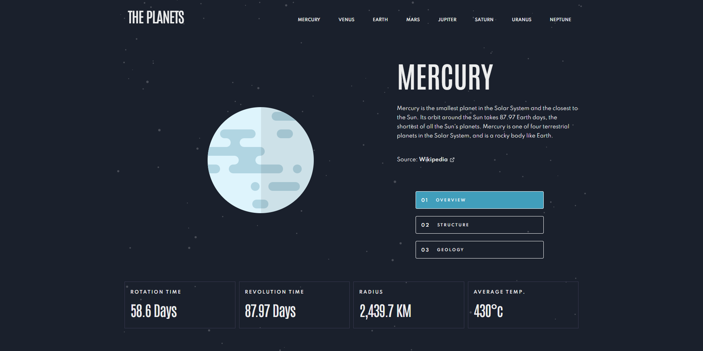
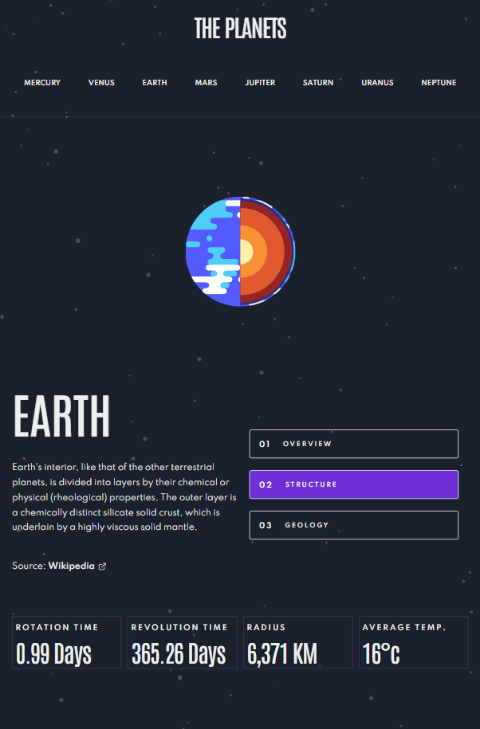
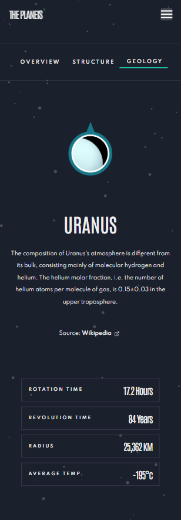
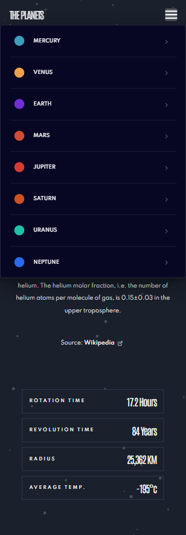

# Frontend Mentor - Planets fact site solution

This is a solution to the [Planets fact site challenge on Frontend Mentor](https://www.frontendmentor.io/challenges/planets-fact-site-gazqN8w_f). Frontend Mentor challenges help you improve your coding skills by building realistic projects.

## Table of contents

- [Overview](#overview)
  - [The challenge](#the-challenge)
  - [Screenshot](#screenshot)
  - [Links](#links)
- [My process](#my-process)
  - [Built with](#built-with)
  - [What I learned](#what-i-learned)
  - [Continued development](#continued-development)
  - [Useful resources](#useful-resources)
- [Author](#author)
- [Acknowledgments](#acknowledgments)

## Overview

### The challenge

Users should be able to:

- View the optimal layout for the app depending on their device's screen size
- See hover states for all interactive elements on the page
- View each planet page and toggle between "Overview", "Internal Structure", and "Surface Geology"

### Screenshot

### Links

- Solution URL: [Github - Planets Facts](https://github.com/dors001/planets-facts-site)
- Live Site URL: [Planets Facts](https://planets-facts-site-six.vercel.app/)

## My process

### Built with

- CSS custom properties
- Flexbox
- CSS Grid
- Mobile-first workflow
- [React](https://reactjs.org/) - JS library
- [Chakra-Ui](https://chakra-ui.com/) - For styles

### What I learned

This project was a great opportunity to fine tune my knowledge using hooks, effects and state methods.
I put more emphasise on dividing the markup and logic into a smaller components for extra modularity, but along the way i've realize that even in doing that there should be a well thought out architectual design. There were a few times in the late stages of the project that i would rather create components that were better suited to handle certain logic aspects, such as populating the information when clicking any buttons.
Chakra UI is a great tool to quickly set up an aesthetically pleasing application or website but when there is a drawback to that:
A. In many cases styles in index.css were overwritten by the chakra ui styles, that resulted in styles to be written in the component itself, making the code a bit unreadable at times.
B. Using style variables to make the code more generic and readable was impossible at times because of the way chakra ui imposes you to write styles in a certain way.

For the next project i'll try Tailwind to see if it gives an oppertunity for a more readable code.

### Continued development

I need to fine tune my understanding further of effects and hooks, even though i used them a lot in this project i still feel there is some work to be done in that aspect.

In the future projects i'll be more careful about the component design, while in this project i initially created a component without implementing any methods in the next projects i'll create components with the logic in mind from the beggining.

For styles i understand the limitation that Chakra-UI is presenting, therefor i'll use Tailwind next.

## Author

- Frontend Mentor - [@dors001](https://www.frontendmentor.io/profile/dors001)
